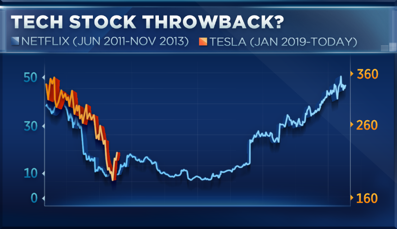

```{r setup, include=FALSE}
options(htmltools.dir.version = FALSE)

knitr::opts_chunk$set(
  echo = FALSE,
  warning = FALSE,
  error = FALSE, 
  message = FALSE,
  cache = TRUE,
  dpi = 300,
  fig.height = 8, fig.width = 12)
```

# Hi, I'm Steph

```{r husband, fig.width=10, fig.align='center'}

```

---

# Masters by Research

## Prof. Di Cook
## Prof. Kerrie Mengersen
## Dr Earl Duncan 


---


#What is the point of visualisation?

--


##Communicate insights


```{r libraries, echo=FALSE}
library(tidyverse)
library(absmapsdata)
library(lubridate)
library(ggridges)
library(sf)
library(polite)
library(rvest)
```

--

```{r blonde, fig.width = 12, fig.align='center'}
knitr::include_graphics("https://media.giphy.com/media/yWS2itifUpxja/giphy.gif")
```

---

class: centerr

# How hard can it be?




---

class: center

# How hard can it be?


---

class: inverse, center, middle


---

# We have some data

## Let's ask ourselves:

- What is this data?
- Do I know what insights I have?
- What is the appropriate visual display?


---

# Scrape LGA daily cases in NSW


- *What is this data?*
COVID LIVE: Active cases, daily in each LGA

- *Do I know what insights I have?*
There are some LGA heavily affected in the recent outbreak

- *What is the appropriate visual display?*


```{r clive, fig.height = 8, fig.align='center'}

```

```{r polite}
host <- "https://covidlive.com.au/report/cases-by-lga/nsw"
session <- bow(host)
```

```{rvest, eval = FALSE}
NSWlgas <- read_html("https://covidlive.com.au/report/cases-by-lga/nsw")
NSWlgas <- html_table(NSWlgas)[[2]] %>% 
              mutate(LGA_url = paste0("https://covidlive.com.au/nsw/",
                                      str_replace_all(tolower(LGA), " ", "-")))

#Create a function to extract daily cases
casetables <- function(url, LGA){
  print(LGA)
  tbl <- read_html(url)
  cases <- html_table(tbl)[[2]] %>%
    mutate(LGA = LGA)
  return(cases)
}

#Create list of tables
lga_covid <- map2(.x = NSWlgas$LGA_url, .y = NSWlgas$LGA,
                            .f = ~casetables(url = .x, LGA = .y)) 
              
lga_covid <- lga_covid %>% 
  purrr::map_dfr(.f =function(.x = tib){
                  as.tibble(.x) %>% 
                  mutate(`28d TESTS` = is.numeric(`28d TESTS`)) })

lga_covid <- lga_covid %>% 
              mutate(Year = ifelse(str_detect(DATE, "Dec"), "2020","2021"),
                     Date = dmy(paste(DATE, Year)))

write_csv(lga_covid, "data/lga_covid.csv")
```


---

# Let's get started

```{r lgacovid}
lga_covid <- read_csv("data/lga_covid.csv")
lga_covid %>%
  filter(Date == Sys.Date()-1) %>% 
  ggplot() + geom_col(aes(x = LGA, y = ACTIVE))
```

## We can do better

---

# This gets us closer to our insight

```{r lgacovid2}
lga_covid %>%
  filter(Date == Sys.Date()-1) %>% 
  slice_max(n = 10, order_by = ACTIVE) %>% 
  ggplot() + 
  geom_col(aes(x = LGA, y = ACTIVE)) + 
  coord_flip()
```


---

# We have improved it, incrementally 

```{r lgacovid3}
lga_top10 <- lga_covid %>%
  filter(Date == Sys.Date()-1) %>% 
  mutate(LGA = fct_reorder(LGA, ACTIVE)) %>% 
  slice_max(n = 10, order_by = ACTIVE) 

lga_top10 %>% 
  ggplot() + 
  geom_col(aes(x = LGA, y = ACTIVE)) + 
  coord_flip()
```


---

# Ridge plot with ggridges

```{r lgaridge1}
lga_covid %>% group_by(LGA) %>% 
  filter(LGA %in% lga_top10$LGA) %>%  
  ggplot() + 
  geom_ridgeline(scale = 0.005, 
                 aes(x = Date, y = fct_reorder(LGA, ACTIVE, max), height = ACTIVE))
```


---

# We have arrived at our insights

## But, there is more we can do

```{r lgaridge2}
library(ggridges)
lga_covid %>% group_by(LGA) %>% 
  filter(LGA %in% lga_top10$LGA) %>%
  filter(Date > dmy("08-06-2021")) %>% 
  ggplot() + 
  geom_ridgeline(scale = 0.005, 
                 aes(x = Date, y = fct_reorder(LGA, ACTIVE, max), height = ACTIVE))
```


---


# Let's make a map

```{r lgas}
lga2020 <- read_sf("data/LGA_2020_AUST.shp") %>% 
  separate(LGA_NAME20, into = c("LGA_NAME20", "extra"), sep =  ' (?=[^ ]+$)') %>% 
  filter(STE_NAME16 %in% c("Australian Capital Territory", "New South Wales")) %>% 
  mutate(LGA_NAME20 = case_when(
                      LGA_NAME20 == "Campbelltown (C)" ~ "Campbelltown",
                      LGA_NAME20 == "Central Coast (C)" ~ "Central Coast",
                      LGA_NAME20 == "Nambucca Valley" ~ "Nambucca",
                      TRUE ~ LGA_NAME20))

lga2020smp <- lga2020 %>% 
  st_simplify(preserveTopology = TRUE, dTolerance = 0.001)
```

```{r map}
map <-
lga2020smp %>%
  ggplot() +
  geom_sf(aes(geometry = geometry))  # use the geometry variable

map
```

--


--


---

```{r map1, fig.height = 8}
map1 <- lga2020smp %>% 
  ggplot() +
  geom_sf(aes(geometry = geometry)) +  # use the geometry variable
  xlim(140, 154)
map1
```


---

# With some data

```{r data}
covid_map_data <- lga2020 %>%
  filter(LGA_NAME20 %in% c( "Bayside", "Blacktown", "Blue Mountains", "Burwood", "Camden", "Campbelltown", "Canada Bay", "Canterbury-Bankstown", "Central Coast", "Cumberland", "Fairfield", "Georges River", "Hawkesbury", "Hornsby", "Hunter's Hill", "Inner West", "Ku-ring-gai", "Lane Cove", "Lithgow", "Liverpool", "Mosman", "North Sydney", "Northern Beaches", "Oberon", "Parramatta","Penrith", "Randwick", "Ryde", "Strathfield",  "Sutherland Shire", "Sydney",  "The Hills Shire",  "Waverley", "Willoughby", "Woollahra", "Wollondilly", "Wollongong")) %>% 
  left_join(lga_covid, by = c("LGA_NAME20" = "LGA")) %>%  mutate(NET = as.numeric(NET))
```


```{r covidmap, fig.height = 8}
covidmap1 <-
covid_map_data %>%
  filter(Date == dmy("24-07-2021")) %>% 
  ggplot() +
  geom_sf(aes(geometry = geometry, fill = ACTIVE)) + 
  xlim(150.4, 151.4) + ylim(-34.2, -33.5)
covidmap1
```

---


class: inverse, center

# Do we have a map?

--

## Yes, but we can do better


---

#Improve graphical elegance 


Prof Di Cook presented these in her Data Modelling and Computing Course:
https://ebsmonash.shinyapps.io/lecture4b_visualisation/

.pull-left[

- Colour palettes
- Colour blindness
- Pre-attentiveness
- Proximity
- Themeing
- Interactivity
]


---

#Colour palettes

 - Qualitative: categorical variables
 - Sequential: low to high numeric values
 - Diverging: negative to positive values


```{r cpals, fig.height = 8, fig.align='center'}

```

---

# Colour blindness

```{r colourb}
library(scales)
df <- data.frame(x=runif(100), y=runif(100), cl=sample(c(rep("A", 50), rep("B", 50))))
p <- ggplot(data=df, aes(x, y, colour=cl)) + theme_bw() + 
  geom_point() + theme(legend.position = "none", aspect.ratio=1)
clrs <- hue_pal()(3)
p
```


---

# Colour blindness

```{r colourb2}
library(dichromat)
clrs <- dichromat(hue_pal()(3))
p + scale_colour_manual("", values=clrs) 
```


---

#Pre-attentive

```{r prea}
df <- data.frame(x=runif(100), y=runif(100), cl=sample(c(rep("A", 1), rep("B", 99))))
ggplot(data=df, aes(x, y, shape=cl, size = 3)) + theme_bw() + 
  geom_point() +
  theme(legend.position="None", aspect.ratio=1)
```

---

#Pre-attentive

```{r}
ggplot(data=df, aes(x, y, colour=cl, size = 3)) + 
  geom_point() +
  theme_bw() + 
  theme(legend.position="None", aspect.ratio=1) +
  scale_colour_brewer(palette="Set1")
```


---

#Proximity

```{r prox1}
df2 <- data.frame(x=c(rnorm(50, mean = -0.5, sd = 0.2),
                      rnorm(20, mean = 0.5, sd = 0.20),
                      rnorm(30, mean = 0.5, sd = 0.15)), 
                  y=c(rnorm(50, mean = -0.3, sd = 0.2),
                      rnorm(20, mean = -0.3, sd = 0.20),
                      rnorm(30, mean = 0.5, sd = 0.2)), 
                 cl=sample(c(rep("A", 50), rep("B", 20), rep("C", 30))))
  
ggplot(data=df2, aes(x, y)) + theme_bw() + 
  geom_point() +
  theme(legend.position="None", aspect.ratio=1)
```

---

#Proximity

```{r prox2}

ggplot(data=df2, aes(x, y, colour = cl)) + theme_bw() + 
  geom_point() +
  theme(legend.position="None", aspect.ratio=1)
```


---

# How do we do this in R?

## Make a theme!

---

#*Goal:* Maximise the data-ink ratio

##*What is Data-Ink?* The non-erasable core of a graphic.


--

##*Solution:* Erase redundant and non-data-ink

---

#Let's have a go!

```{r covidmap1, fig.height = 8}
covidmap1 <- covidmap1 + 
  scale_fill_distiller(type = "seq", direction = "1")
  
covidmap1
```


---

# Colour palettes

```{r covidmap2, fig.height = 8}
covidmap2 <- covid_map_data %>%
  filter(Date == dmy("24-07-2021")) %>% 
  ggplot() +
  geom_sf(aes(geometry = geometry, fill = ACTIVE), colour = "lightgrey") + 
  xlim(150.4, 151.4) + ylim(-34.2, -33.5) +
  scale_fill_distiller(type = "seq", direction = "1", palette = "OrRd") 
  
covidmap2
```

---

# Erase the non-data ink

```{r covidmap3, fig.height = 8}
covidmap3 <- covidmap2 +
  theme(axis.text = element_blank(), 
        axis.title = element_blank(), 
        axis.ticks = element_blank()) 
  
covidmap3
```

---

# Move the legend

```{r covidmap4, fig.height = 8}
covidmap4 <- covidmap3  +
  theme(axis.text = element_blank(), 
        axis.title = element_blank(), 
        axis.ticks = element_blank(),
        legend.position = "bottom") +
  guides(fill=guide_legend("Number of active COVID19 cases"))
  
covidmap4
```

---

# Give it a title

```{r covidmap5, fig.height = 8}
covidmap5 <- covidmap4 + 
  labs(title = "Fairfield LGA currently has a high number of active cases.")
  
covidmap5
```

---

# Give context in the title

```{r covidmap6, fig.height = 8}
lgacentroids <- st_centroid(lga2020smp) %>% 
  left_join(lga_covid, by = c("LGA_NAME20" = "LGA")) %>% 
  filter(Date == ymd(Sys.Date())) %>% 
  slice_max(order_by = ACTIVE, n = 5)

covidmap6 <- covidmap5 +
  theme(axis.text = element_blank(), 
        axis.title = element_blank(), 
        axis.ticks = element_blank(),
        legend.position = "bottom") +
  labs(title = "In the Greater Sydney area, the Fairfield LGA currently has the highest number of active cases.") +
  geom_sf_text(aes(geometry = geometry, label = LGA_NAME20), data = lgacentroids)
  
covidmap6
```

---

# Australian Cancer Atlas

## It is hard to make one size fit all with a budget

- Overall distribution in familiar geography
- Colour scheme 
- Supplementary visuals
- Facilitate comparisons with pop ups

---

class: inverse, center, middle

# Thanks for coming!


---

# Where to from here?

# For friends: runapp!

# To learn more:
[](alison.netlify.app/rlm-sad-plot-better/)
[](https://ggplot2.tidyverse.org/reference/ggtheme.html)

Naomi B Robbins: Creating More Effective Graphs